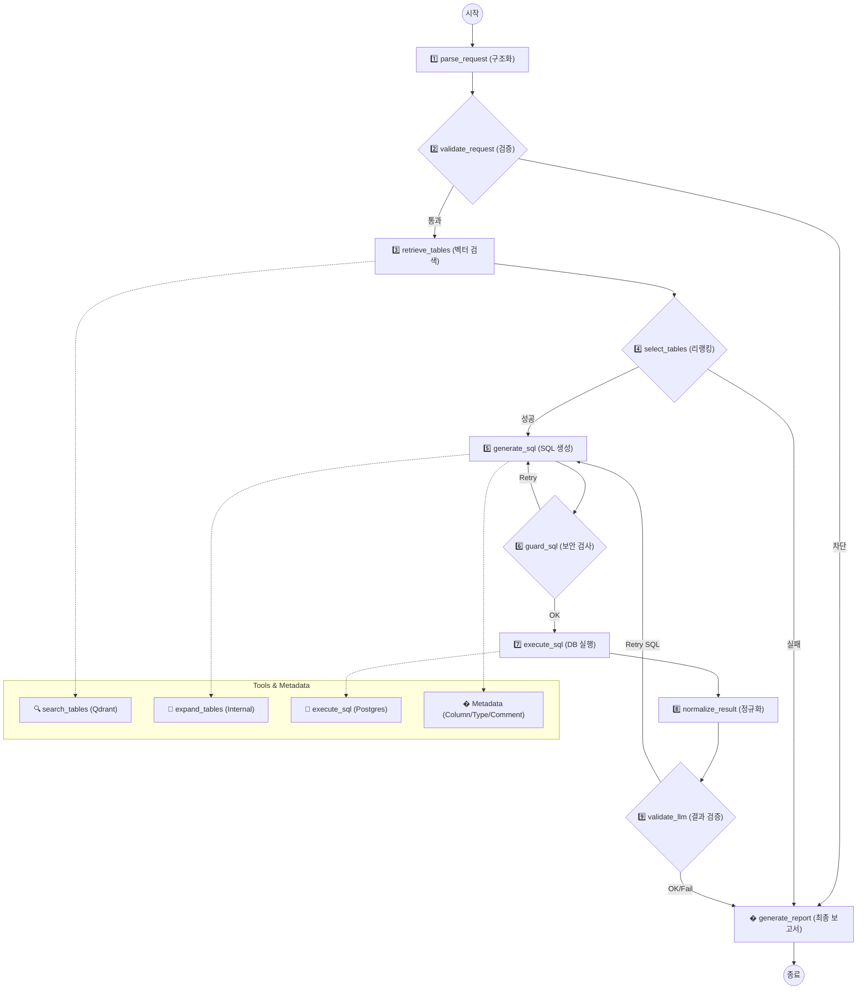

# 🤖 Text-to-SQL Agent (Server Agent)

**서버 모니터링 및 자연어 데이터 분석 에이전트**

이 프로젝트는 자연어 질문을 SQL 쿼리로 변환하여 데이터베이스를 조회하고, 서버 리소스 상태를 실시간으로 모니터링하는 지능형 에이전트 시스템입니다.  
**RAG (Retrieval-Augmented Generation)** 기법과 **LangGraph** 기반의 워크플로우를 사용하여 복잡한 질의를 처리하며, **실시간 스키마 감지** 기능을 통해 DB 구조 변경에 즉시 대응합니다.

---

## 🔥 핵심 기능 (Key Features)

### 1. 🛡️ 보안 미들웨어 (Security Middleware)
사용자의 입력이 시스템에 도달하기 전, **`InputGuard` 미들웨어**가 위험한 요청을 사전에 차단합니다.
- **프롬프트 인젝션 방지**: "Ignore previous instructions", "System prompt" 등 LLM의 동작을 조작하려는 시도를 차단합니다.
- **입력 길이 제한**: 과도한 토큰 사용 유발을 방지합니다 (최대 1000자).
- **SQL 안전성 검사**: 생성된 SQL 쿼리에 `DROP`, `DELETE`, `TRUNCATE` 등 파괴적인 명령어가 포함되었는지 2차 검증합니다.

### 2. ⚡ 실시간 스키마 동기화 (Real-time Schema Sync)
데이터베이스의 테이블이 생성되거나 변경되는 즉시 에이전트가 이를 인지합니다.
- **PostgreSQL LISTEN/NOTIFY**: `SchemaListener`가 DB의 DDL 이벤트를 실시간으로 수신합니다.
- **자동 임베딩 업데이트**: 스키마 변경 시 Qdrant 벡터 저장소의 관련 정보를 자동으로 갱신하여, 에이전트가 항상 최신 테이블 구조를 기반으로 답변할 수 있습니다.

### 3. 🧠 지능형 질의 구조화 및 정규화 (LLM JSON Mode)
사용자의 투박한 질문을 에이전트가 이해하기 쉬운 정교한 구조로 변환합니다.
- **LLM JSON Mode**: 사용자 질문을 즉시 분석하여 파라미터화된 JSON 구조로 변환합니다.
- **시간 범위 정규화**: "오늘 데이터 보여줘"와 같은 질문 시, 현재 시각(예: 오후 3시)을 기준으로 00:00부터 **현재 시각**까지만 조회하도록 범위를 자동으로 교정하여 미래 데이터가 포함되지 않게 합니다.
- **미들웨어 검증**: 구조화된 질문이 유효한지 미들웨어 단계에서 한 번 더 검증하여 SQL 생성의 정확도를 높입니다.

### 4. 🔗 스키마 자동 인식 및 고급 RAG (Table Discovery)
에이전트가 여러 테이블 중 정답을 찾기 위해 벡터 DB와 실시간 스키마 정보를 결합합니다.
- **프로젝트 시작 시 자동 인식**: 서버 구동 시 DB의 전체 스키마를 자동으로 스캔하고 테이블 명세(DDL, 주석)를 추출합니다.
- **벡터화 및 검색**: 추출된 테이블 정보를 Qdrant 벡터 DB에 저장하고, 사용자의 구조화된 질문에서 추출된 질의를 기반으로 가장 적합한 테이블을 RAG(Retrieval) 방식으로 검색해옵니다.
- **동적 컨텍스트 제공**: 검색된 테이블의 **컬럼명, 데이터 타입, 제약 조건(PK/FK), 테이블 주석(Comment)** 등 상세 메타데이터를 SQL 생성 프롬프트에 동적으로 삽입하여 환각(Hallucination) 없는 정확한 쿼리를 유도합니다.
- **지능형 테이블 확장 및 캐싱**: 
    - LLM 리랭크(Rerank)를 거쳐 가장 관련성 높은 **Top-5** 테이블을 우선적으로 컨텍스트에 포함합니다.
    - Top-5에 들지 못한 나머지 후보 테이블들은 내부 캐시에 안전하게 보관합니다.
    - 쿼리 생성이나 검증 단계에서 "테이블 정보가 부족하다"고 판단될 경우, 에이전트가 스스로 **툴 콜(Tool Call)**을 수행하여 캐시된 후보들 중 필요한 테이블을 추가로 탐색하고 컨텍스트를 확장합니다.

### 5. 📂 지속성 채팅 이력 (Persistent Chat History)
사용자와의 모든 대화 결과는 데이터베이스에 안전하게 기록됩니다.
- **세션 기반 관리**: 채팅별 세션 관리를 통해 이전 대화 맥락을 유지하고 나중에 다시 확인할 수 있습니다.
- **자동 제목 생성**: 대화의 첫 문장을 분석하여 채팅 세션의 제목을 자동으로 설정합니다.
- **효율적인 상태 관리**: 메시지 유실 방지를 위한 트랜잭션 기반 저장 구조를 갖추고 있습니다.

### 6. 📊 리소스 모니터링 대시보드
- **실시간 지표**: CPU, 메모리, 디스크 사용량을 실시간으로 시각화합니다.
- **고급 알림 규칙 (Lego Blocks)**: 사용자가 직접 "CPU > 80% 일 때 알림" 같은 규칙을 웹 UI에서 블럭 조립하듯 설정할 수 있습니다.

### 7. 🔌 제로 구성 이식성 (Zero-Config Portability)
이 시스템은 특정 데이터베이스에 종속되지 않는 유연한 구조를 가지고 있습니다.
- **자동 스키마 구축**: `.env`에서 DB 연결 정보만 변경하면, 서버 시작 시 채팅 저장 및 모니터링에 필요한 모든 테이블, 스키마, 그리고 **스키마 변경 및 사용자 규칙기반 모니터링을 위한 이벤트 함수 및 트리거**까지 자동으로 생성합니다.
- **즉시 재사용 가능**: 기존에 사용하던 모든 에이전트 워크플로우와 알림 설정 체계가 새로운 DB 환경에서도 즉시 적용되어, 환경 이관이나 복구가 매우 빠릅니다.

---

## 🛠️ 기술 스택 (Tech Stack)

### Backend
- **Framework**: `FastAPI` (High-performance API)
- **Agent Orchestration**: `LangGraph`, `LangChain`
- **Database**: `PostgreSQL` (Asyncpg for async I/O)
- **Vector Store**: `Qdrant` (Schema embedding & storage)
- **Tooling**: `MCP (Model Context Protocol)` (Standardized tool interface)

### Frontend
- **Framework**: `React`, `Vite` (TypeScript)
- **Styling**: `Vanilla CSS` (Dark Theme Optimized)
- **Components**: `Lucide React` (Icons)

---

## 🚀 에이전트 워크플로우 (Architecture Flow: LangGraph)

에이전트는 **LangGraph**를 기반으로 설계되었으며, 각 단계(Node)는 명확한 책임과 도구(Tool)를 가집니다. 특히 실패 시 스스로 쿼리를 수정하거나 테이블 정보를 추가로 확장하는 **순환 구조(Cyclic)**를 가집니다.



### 📋 노드별 상세 설명 및 도구 호출

| 단계 | 노드명 (Node) | 역할 및 상세 설명 | 사용 도구 / 기술 |
| :--- | :--- | :--- | :--- |
| **1** | **`parse_request`** | 사용자 자연어를 분석하여 **의도(Intent), 지표(Metric), 시간 범위** 등을 JSON으로 구조화합니다. | `ChatOpenAI` (JSON Mode) |
| **2** | **`validate_request`** | 구조화된 요청의 보안성과 논리적 타당성을 검증합니다. (예: 미래 시점 조회 방지, 시각 보정) | `ParsedRequestGuard` (Middleware) |
| **3** | **`retrieve_tables`** | 질문과 관련 있는 테이블을 벡터 공간에서 검색하여 후보군을 확보합니다. | **Tool**: `search_tables` (Qdrant) |
| **4** | **`select_tables`** | 확보된 후보 중 **Top-K(Elbow Cut)**를 적용하여 실제 쿼리에 사용할 테이블을 확정합니다. | `LLM Rerank` |
| **5** | **`generate_sql`** | 정밀한 테이블 메타데이터를 참조하여 SQL을 생성합니다. 정보 부족 시 스스로 캐시된 테이블을 확장합니다. | **Tool**: `expand_tables` (Internal Cache) |
| **6** | **`guard_sql`** | 생성된 SQL이 `DROP` 등 파괴적인 명령을 포함하는지, 문법이 맞는지 사전에 검사합니다. | `SqlOutputGuard` (Middleware) |
| **7** | **`execute_sql`** | 최종 검증된 SQL을 PostgreSQL 데이터베이스에서 실행하여 결과를 가져옵니다. | **Tool**: `execute_sql` (Postgres) |
| **8** | **`normalize_result`** | 실행 결과 데이터의 가독성을 높이고, 에러 메시지를 기술적으로 정규화합니다. | `Result Normalizer` |
| **9** | **`validate_llm`** | 실행 결과가 사용자의 질문에 부합하는지 최종 검증합니다. 부족할 경우 **고쳐쓰기(Retry)**를 요청합니다. | **Cyclic**: `Reflection` & `Self-Healing` |
| **10** | **`generate_report`** | 최종 데이터와 분석 내용을 바탕으로 사용자가 이해하기 쉬운 자연어 리포트를 작성합니다. | `Markdown Report Gen` |

### 🧠 핵심 기술: 지능형 테이블 캐싱 및 확장
- **Top-5 Rerank**: 벡터 검색 결과 중 가장 연관성이 높은 5개 테이블을 우선 컨텍스트로 사용합니다.
- **후보군 캐싱**: TOP-5에 들지 못한 나머지 테이블은 내부 상태에 캐싱해 둡니다.
- **Dynamic Expansion**: `generate_sql` 노드에서 LLM이 테이블 정보가 더 필요하다고 판단하면, `expand_tables` 툴을 호출하여 캐시에서 관련 테이블을 즉시 추가하고 쿼리를 재생성합니다.

---

## 📂 프로젝트 구조 (Directory Structure)

본 프로젝트는 도메인 중심의 모듈화된 구조를 가지고 있으며, 각 디렉토리는 명확한 책임 범위를 가집니다.

<details>
<summary><b>상세 디렉토리 구조 보기 (클릭하여 확장)</b></summary>

```text
server-agent/
├── backend/src/             # 🏰 Core Engine (FastAPI & 에이전트 로직)
│   ├── advanced_settings/   # 알림 조건(Lego Blocks) 기반 모니터링 모듈
│   │   ├── schemas.py       # Pydantic 기반 데이터 검증 모델 (Rule/History)
│   │   ├── templates.py     # SQL 기반 트리거 및 함수 생성용 템플릿
│   │   ├── service.py       # 알림 규칙 관리 및 MCP 서버 통신 제어
│   │   ├── listener.py      # DB NOTIFY 채널 실시간 수신 전용 리스너
│   │   ├── router.py        # 규칙 CRUD 및 알림 이력 조회 API
│   │   └── core.py          # 하위 호환성 유지를 위한 래퍼(Deprecated)
│   ├── agents/              # 지능형 에이전트 및 통신 클라이언트
│   │   ├── text_to_sql/     # Text-to-SQL 메인 워크플로우 (LangGraph)
│   │   │   ├── graph.py     # 에이전트 상태 전이 및 그래프 구조 정의
│   │   │   ├── nodes.py     # 파싱, 검색, 생성, 검증 등 핵심 노드 구현체
│   │   │   ├── prompts.py   # 단계별 시스템/사용자 지능형 프롬프트 소스
│   │   │   ├── state.py     # 에이전트 실행 중 유지되는 상태 정보(State) 정의
│   │   │   └── table_expand_tool.py # 캐시 기반 테이블 정보 확장 도구
│   │   └── mcp_clients/     # 외부 MCP 서버 통합 클라이언트
│   │       └── connector.py # HTTP 프로토콜 기반 MCP 서버 연동 공통 모듈
│   ├── api/                 # FastAPI 웹 프레임워크 인프라
│   │   ├── main.py          # 앱 진입점, 라우터 및 미들웨어 통합 등록
│   │   ├── lifespan.py      # Startup/Shutdown 관리 (DB 초기화, 리스너 제어)
│   │   ├── query.py         # 에이전트 질의 및 스트리밍 답변 API
│   │   ├── chat.py          # 채팅 이력, 세션 관리 및 제목 자동 생성 API
│   │   └── resource.py      # 실시간 서버 자원(CPU/MEM) 모니터링 API
│   ├── db/                  # 데이터 저장소 액세스 레이어
│   │   └── db_manager.py    # 커넥션 풀 초기화 및 채팅 기록 CRUD 총괄
│   └── schema/              # 지능형 DB 스키마 관리 및 벡터화
│       ├── orchestrator.py  # 초기 동기화 및 실시간 리스너 실행 제어
│       ├── listener.py      # PostgreSQL DDL(스키마 변경) 이벤트 실시간 감지
│       ├── sync.py          # 변경된 스키마를 벡터화하여 Qdrant 자동 반영
│       ├── trigger_setup.py # 스키마 변경 감지를 위한 전용 트리거 자동 설치
│       └── hash_utils.py    # 스키마 변경 여부(Diff)를 판별하는 해시 유틸리티
├── mcp_servers/             # 🔌 Standardized Tools (MCP 서버군)
│   ├── postgres/            # DB 지능형 제어 서버 (SQL 실행, 스키마 추출)
│   │   ├── server.py        # MCP 도구 정의 및 실행 로직
│   │   └── Dockerfile       # 독립 실행형 컨테이너 설정
│   └── qdrant/              # 벡터 검색 서버 (테이블 시맨틱 검색)
│       ├── server.py        # Qdrant 검색 및 임베딩 도구 제공
│       └── Dockerfile       # 독립 실행형 컨테이너 설정
└── frontend/                # 📊 Dashboard (React + Vite)
    ├── src/                 # 대시보드 UI 및 상태 관리 로직
    └── index.html           # SPA 진입점
```

</details>

---

## 🚀 시작하기 (Getting Started)

### 1. 환경 변수 설정
`.env` 파일을 생성하고 필요한 API 키와 DB 설정을 입력하세요.

### 2. 실행
Docker Compose를 사용하여 모든 서비스를 한 번에 실행합니다.

```bash
docker compose up --build -d
```

### 3. 접속
- **웹 UI**: [http://localhost:5173](http://localhost:5173) (또는 80번 포트 설정에 따름)
- **API 문서**: [http://localhost:8000/docs](http://localhost:8000/docs)
