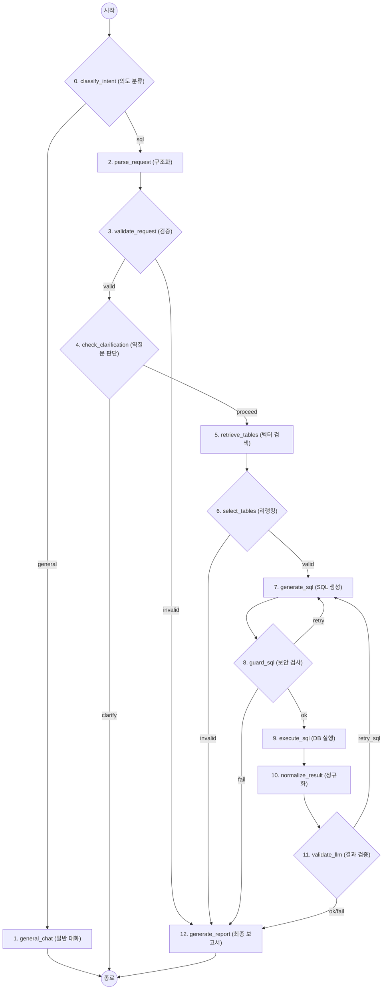

# 🤖 Text-to-SQL Agent (Server Agent)

**서버 모니터링 및 자연어 데이터 분석 에이전트**

이 프로젝트는 자연어 질문을 SQL 쿼리로 변환하여 실시간으로 쌓이는 데이터베이스를 조회하고, 서버 리소스 상태를 모니터링하는 지능형 에이전트 시스템입니다.  
**RAG (Retrieval-Augmented Generation)** 기법과 **LangGraph** 기반의 워크플로우를 사용하여 복잡한 질의를 처리하며, **실시간 스키마 감지** 및 **사용자 규칙 기반 알림** 기능을 통해 DB 구조 변경과 서버 리소스 상태 변화에 즉시 대응합니다.

---

## 🔥 핵심 기능 (Key Features)

### 1. 🛡️ 보안 미들웨어 (Security Middleware)
사용자의 입력이 시스템에 도달하기 전, **`InputGuard` 미들웨어**가 위험한 요청을 사전에 차단합니다.
- **프롬프트 인젝션 방지**: "Ignore previous instructions", "System prompt" 등 LLM의 동작을 조작하려는 시도를 차단합니다.
- **입력 길이 제한**: 과도한 토큰 사용 유발을 방지합니다 (최대 1000자).
- **SQL 안전성 검사**: 생성된 SQL 쿼리에 `DROP`, `DELETE`, `TRUNCATE` 등 파괴적인 명령어가 포함되었는지 2차 검증합니다.

### 2. ⚡ 실시간 스키마 동기화 (Real-time Schema Sync)
데이터베이스의 테이블이 생성되거나 변경되는 즉시 에이전트가 이를 인지합니다.
- **PostgreSQL LISTEN/NOTIFY**: `SchemaListener`가 DB의 DDL 이벤트를 실시간으로 수신 대기합니다.
- **자동 임베딩 업데이트**: 스키마 변경 시 Qdrant 벡터 저장소의 관련 정보를 자동으로 갱신하여, 에이전트가 항상 최신 테이블 구조를 기반으로 답변할 수 있습니다.

### 3. 🧠 지능형 질의 구조화 및 미들웨어 검증 (LLM & Middleware)
사용자의 투박한 질문을 에이전트가 분석하기 최적화된 정교한 구조로 변환하고, 미들웨어를 통해 데이터의 신뢰성을 보장합니다.
- **LLM JSON Mode**: 사용자 질문을 즉시 분석하여 의도(Intent)와 파라미터가 분리된 정밀한 JSON 구조로 변환합니다. 이는 에이전트가 모호함 없이 쿼리를 생성할 수 있는 토대가 됩니다.
- **`ParsedRequestGuard` 미들웨어 검증 및 교정**:
    - **시간 범위 기본값 미적용**: 사용자가 시간을 명시하지 않으면 시간 조건을 추가하지 않습니다(전체 기간 기준).
    - **미래 시점 Auto-Clipping**: "오늘 데이터 보여줘"와 같은 요청 시 LLM이 시간 범위를 00:00~24:00로 설정하더라도, 미들웨어가 현재 시각을 확인하여 **24:00인 종료 시간(End Time)을 현재 시각으로 즉시 교정**합니다.
    - **후속 질문 상속 플래그**: 참조 표현을 감지하면 `inherit` 모드로 표시하고, 이전 쿼리의 시간 조건/필터를 유지하도록 유도합니다.
    - **에이전트 친화적 구조 확립**: 구조화된 질문이 물리적/논리적으로 유효한지 미들웨어 단계에서 한 번 더 검증하고 보정함으로써, 에이전트가 환각(Hallucination) 없이 정확한 SQL을 생성하도록 유도합니다.

### 4. 🔗 스키마 자동 인식 및 고급 RAG (Table Discovery)
에이전트가 여러 테이블 중 정답을 찾기 위해 벡터 DB와 실시간 스키마 정보를 결합합니다.
- **프로젝트 시작 시 지능적 동기화 (Hash-based Smart Sync)**: 
    - **최초 구동 시**: 데이터베이스의 전체 스키마를 자동으로 스캔하여 테이블 명세(DDL, 주석)를 추출하고 벡터화를 수행합니다.
    - **재시작 시 (중복 작업 방지)**: 이전 구동 시 저장된 **스키마 해시(Hash)** 값과 현재 DB 상태를 비교합니다. 데이터베이스 구조에 변경이 없으면 무거운 스캔 및 임베딩 과정을 스킵하여 서버 시작 속도를 획기적으로 향상시킵니다.
    - **실시간 데이터 동기화**: 시작 시 해시값이 다르거나 구동 중 DDL 이벤트가 발생하면 즉시 변경 사항을 감지하여 최신 상태로 동기화합니다.
- **벡터화 및 검색**: 추출된 테이블 정보를 Qdrant 벡터 DB에 저장하고, 사용자의 구조화된 질문에서 추출된 질의를 기반으로 가장 적합한 테이블을 RAG(Retrieval) 방식으로 검색해옵니다.
- **정밀한 컨텍스트 주입 (Targeted Information Injection)**: 
    - 벡터 검색을 통해 질문과 가장 관련 있는 테이블-청크를 선별한 후, 해당 테이블의 **정확한 명칭(Table Name)**과 **전체 컬럼 목록(Column List)**을 추출합니다.
    - 단순히 스키마 정보만 나열하는 것이 아니라, 각 컬럼이 **어떤 데이터를 담고 있는지에 대한 상세 설명(Comment/Description)**을 함께 제공합니다. 이를 통해 LLM은 테이블 간의 관계와 각 컬럼의 용도를 명확히 이해하고, 실제 실행 가능한 최적의 SQL을 생성하게 됩니다.
- **지능형 테이블 확장 및 캐싱**: 
    - LLM 리랭크(Rerank)를 거쳐 가장 관련성 높은 **Top-5** 테이블을 우선적으로 컨텍스트에 포함합니다.
    - Top-5에 들지 못한 나머지 후보 테이블들은 내부 캐시에 안전하게 보관합니다.
    - 쿼리 생성이나 검증 단계에서 "테이블 정보가 부족하다"고 판단될 경우, 에이전트가 스스로 **툴 콜(Tool Call)**을 수행하여 캐시된 후보들 중 필요한 테이블을 추가로 탐색하고 컨텍스트를 확장합니다.

### 5. 🧠 맥락 인식 및 상태 관리 (Context-aware State Management)
에이전트는 **LangGraph**의 `Checkpointer(PostgresSaver)`를 통해 대화의 모든 상태를 데이터베이스에 영구적으로 저장하고 관리합니다.
- **완벽한 대화 복원 (Thread-based Persistence)**:
    - `thread_id` 하나만 있으면 언제든 이전 대화, 생성된 SQL, 실행 결과, 에러 메시지 등 **모든 상태(State)**를 완벽하게 복원합니다.
    - 단순 텍스트 저장이 아닌, LangChain의 `Message` 객체와 에이전트 내부 변수를 직렬화하여 저장하므로, 서버 재시작 후에도 대화가 끊기지 않습니다.
- **문맥 기반 의도 파악 (Intelligent Context Parsing)**:
    - "전체 기간", "모든 데이터" 등의 표현을 감지하면, 이전 쿼리의 시간 제약에 얽매이지 않고 **능동적으로 전체 범위를 조회(`ALL`)**합니다.
    - "2.5일", "어제"와 같은 **날짜 약어**를 자동으로 인식하여 정확한 날짜(ISO 8601)로 변환합니다.
    - "상위 5개만"과 같은 후속 질문 시, **이전 쿼리의 조건을 똑똑하게 상속(Inherit)**하여 자연스러운 대화를 이어갑니다.
- **하이브리드 HITL (Human-in-the-Loop)**:
    - 정보 부족 시 무리하게 SQL을 생성하지 않고, 즉시 멈추어(Interrupt) 사용자에게 역질문을 던집니다.

### 6. 📊 리소스 모니터링 및 알림 이력 (Dashboard & Alert History)
- **실시간 지표 시각화**: CPU, 메모리, 디스크 사용량을 실시간 차트로 시각화하여 현재 서버 상태를 직관적으로 파악합니다.
- **고급 알림 규칙 (Lego Blocks)**: 사용자가 직접 "CPU > 80% 일 때 알림" 같은 임계치 규칙을 웹 UI에서 블럭 조립하듯 설정할 수 있습니다.
- **지능형 알림 이력 및 추적**: 설정된 트리거가 발생하면 모든 내역이 **알림 히스토리**에 저장됩니다. 이를 통해 어떤 이슈가 **어느 시점에 발생했는지** 빠르게 추적할 수 있으며, 과거 데이터와 비교하여 시스템의 안정성 패턴을 한눈에 파악할 수 있습니다.
- **상승 이벤트 기반 알림**: 임계값을 **넘는 순간**에만 1회 기록하며, 값이 내려갔다가 다시 넘으면 다시 기록됩니다.

### 7. 🔌 제로 구성 이식성 (Zero-Config Portability)
이 시스템은 특정 데이터베이스에 종속되지 않는 유연한 구조를 가지고 있습니다.
- **자동 스키마 구축**: `.env`에서 DB 연결 정보만 변경하면, 서버 시작 시 채팅 저장 및 모니터링에 필요한 모든 테이블, 스키마, 그리고 **실시간 스키마 변경 감지 및 사용자 규칙기반 모니터링에 필요한 이벤트 함수 및 트리거**까지 자동으로 생성합니다. (없을경우에만)
- **즉시 재사용 가능**: 기존에 사용하던 모든 에이전트 워크플로우와 알림 설정 체계가 새로운 DB 환경에서도 즉시 적용되어, 환경 이관이나 복구가 매우 빠릅니다.

---

## 🧭 시간 모드 (Time Mode)
시간 범위가 명시되지 않은 질문과 후속 질문의 동작을 명확히 하기 위해 `time_mode`를 사용합니다.

- **all_time**: 시간 범위가 명시되지 않은 경우. SQL에 시간 조건을 추가하지 않습니다.
- **inherit**: 이전 결과를 참조하는 후속 질문에서 시간 범위를 명시하지 않은 경우. 이전 SQL의 시간 조건을 유지합니다.
- **explicit**: 사용자가 시간 범위를 명시한 경우. 해당 범위를 그대로 반영합니다.

검증 단계에서 `time_mode`와 SQL의 시간 조건이 일치하지 않으면 재생성을 요청합니다.

---

## 🔗 스키마 드롭다운 API
고급 알림 설정 화면에서 테이블/컬럼을 드롭다운으로 선택하기 위해 스키마 목록 API를 제공합니다.

- **GET** `/schema/tables`
  - 반환 형식:
    ```json
    [
      {"table": "schema.table", "columns": ["col1", "col2"]}
    ]
    ```

## 🛠️ 기술 스택 (Tech Stack)

### Backend
- **Framework**: `FastAPI` (High-performance API)
- **Agent Orchestration**: `LangGraph`, `LangChain`
- **Database**: `PostgreSQL` (Asyncpg for async I/O & `asyncio.to_thread` for non-blocking MCP)
- **Vector Store**: `Qdrant` (Schema embedding & storage)
- **Tooling**: `MCP (Model Context Protocol)` (Standardized tool interface)

### Frontend
- **Framework**: `React`, `Vite` (TypeScript)
- **Styling**: `Vanilla CSS` (Dark Theme Optimized)
- **Components**: `Lucide React` (Icons)

---

## 🚀 에이전트 워크플로우 (Architecture Flow: LangGraph)

에이전트는 **LangGraph**를 기반으로 설계되었으며, 각 단계(Node)는 명확한 책임과 도구(Tool)를 가집니다. 특히 실패 시 스스로 쿼리를 수정하거나 테이블 정보를 추가로 확장하는 **순환 구조(Cyclic)**를 가집니다.



### 📋 노드별 상세 설명 및 도구 호출

| 단계 | 노드명 (Node) | 역할 및 상세 설명 | 사용 도구 / 기술 |
| :--- | :--- | :--- | :--- |
| **0** | **`classify_intent`** | 질문을 `sql` / `general`로 분류하여 그래프 분기를 결정합니다. | `ChatOpenAI` (JSON Mode) |
| **1** | **`general_chat`** | `general` 분기에서 일반 대화 응답을 생성하고 종료합니다. | `ChatOpenAI` |
| **2** | **`parse_request`** | 사용자 자연어를 분석하여 **의도/지표/시간 범위**를 구조화합니다. | `ChatOpenAI` (JSON Mode) |
| **3** | **`validate_request`** | 파싱 결과의 보안성과 논리 타당성을 검증/보정합니다. | `ParsedRequestGuard` |
| **4** | **`check_clarification`** | 정보가 부족하면 역질문(HITL)로 분기합니다. | `ChatOpenAI` (JSON Mode) |
| **5** | **`retrieve_tables`** | 질의와 연관된 테이블 후보를 검색합니다. | **Tool**: `search_tables` (Qdrant) |
| **6** | **`select_tables`** | 후보를 리랭크해 실제 SQL 컨텍스트 테이블을 확정합니다. | `LLM Rerank` |
| **7** | **`generate_sql`** | SQL을 생성하고 필요 시 테이블 컨텍스트를 확장합니다. | **Tool**: `expand_tables` (Internal Cache) |
| **8** | **`guard_sql`** | 생성 SQL의 안전성과 문법을 사전 차단합니다. | `SqlOutputGuard` |
| **9** | **`execute_sql`** | 검증된 SQL을 DB에서 실행합니다. | **Tool**: `execute_sql` (Postgres) |
| **10** | **`normalize_result`** | 실행 결과/에러를 정규화하고 재시도 분류 정보를 만듭니다. | `Result Normalizer` |
| **11** | **`validate_llm`** | 결과 적합성을 검증하고 필요 시 SQL 재생성을 트리거합니다. | `Reflection / Self-Healing` |
| **12** | **`generate_report`** | 최종 사용자 응답(리포트)을 생성합니다. | `Markdown Report Gen` |

### 🧠 핵심 기술: 지능형 테이블 캐싱 및 확장
- **Top-5 Rerank**: 벡터 검색 결과 중 가장 연관성이 높은 5개 테이블을 우선 컨텍스트로 사용합니다.
- **후보군 캐싱**: TOP-5에 들지 못한 나머지 테이블은 내부 상태에 캐싱해 둡니다.
- **Dynamic Expansion**: `generate_sql` 노드에서 LLM이 테이블 정보가 더 필요하다고 판단하면, `expand_tables` 툴을 호출하여 캐시에서 관련 테이블을 즉시 추가하고 쿼리를 재생성합니다.

---

## 📂 프로젝트 구조 (Directory Structure)

본 프로젝트는 도메인 중심의 모듈화된 구조를 가지고 있으며, 각 디렉토리는 명확한 책임 범위를 가집니다.

<details>
<summary><b>상세 디렉토리 구조 보기 (클릭하여 확장)</b></summary>

```text
server-agent/
├── backend/src/             # 🏰 Core Engine (FastAPI & 에이전트 로직)
│   ├── advanced_settings/   # 알림 조건(Lego Blocks) 기반 모니터링 모듈
│   │   ├── schemas.py       # Pydantic 기반 데이터 검증 모델 (Rule/History)
│   │   ├── templates.py     # SQL 기반 트리거 및 함수 생성용 템플릿
│   │   ├── service.py       # 알림 규칙 관리 서비스 Layer
│   │   ├── listener.py      # DB NOTIFY 채널 실시간 수신 리스너
│   │   └── router.py        # 규칙 CRUD 및 알림 이력 조회 API
│   ├── agents/              # 지능형 에이전트 핵심 로직
│   │   ├── text_to_sql/     # Text-to-SQL 워크플로우 (LangGraph)
│   │   │   ├── graph.py     # 에이전트 상태 전이 및 그래프 구조 정의
│   │   │   ├── nodes.py     # 분석, 검색, 생성, 검증 노드 단일 모듈
│   │   │   ├── prompts.py   # 단계별 시스템/사용자 프롬프트 관리
│   │   │   ├── state.py     # 에이전트 실행 상태(State) 스키마 정의
│   │   │   ├── table_expand_too.py # 캐시 기반 테이블 정보 확장 도구
│   │   │   └── middleware/  # 입력/출력 및 요청 검증 가드
│   │   │       ├── input_guard.py      # 초기 입력 보안/길이 검사
│   │   │       ├── parsed_request_guard.py # LLM 파싱 결과 논리적 검증
│   │   │       └── sql_safety_guard.py # SQL 파괴적 명령어 차단
│   │   └── mcp_clients/     # 외부 MCP 서버 통합 클라이언트
│   │       └── connector.py # HTTP 기반 MCP 서버 연동 공통 모듈
│   ├── api/                 # FastAPI 웹 프레임워크 인프라
│   │   ├── main.py          # 앱 진입점 및 라우터 통합 등록
│   │   ├── lifespan.py      # Startup/Shutdown 관리 (DB 초기화 등)
│   │   ├── query.py         # 에이전트 질의 및 SSE 스트리밍 API
│   │   ├── schema.py        # 스키마 테이블/컬럼 드롭다운 API
│   │   ├── chat.py          # 채팅 세션 및 기록 관리 API
│   │   └── resource.py      # 실시간 서버 자원 모니터링 API
│   ├── db/                  # 데이터 저장소 액세스 레이어
│   │   ├── db_manager.py    # 커넥션 풀 및 기본 DB 접근 총괄
│   │   └── chat_context.py  # 채팅 요약 상태 및 커서 기반 데이터 접근 전용
│   └── schema/              # 지능형 DB 스키마 관리 및 벡터화
│       ├── orchestrator.py  # 초기 동기화 및 감지 프로세스 제어
│       ├── listener.py      # PostgreSQL DDL 이벤트 실시간 감지
│       ├── sync.py          # 스키마 정보 추출 및 Qdrant 벡터화 동기화
│       ├── trigger_setup.py # 변경 감지 전용 트리거 자동 설치
│       └── hash_utils.py    # 스키마 변경 여부(Diff) 판별 해시 유틸
├── mcp_servers/             # 🔌 Standardized Tools (MCP 서버군)
│   ├── postgres/            # DB 지능형 제어 서버 (SQL 실행 등)
│   └── qdrant/              # 벡터 검색 서버 (테이블 시맨틱 검색)
└── frontend/                # 📊 Dashboard (React + Vite)
    ├── src/                 # 대시보드 UI 및 상태 관리 (TypeScript)
    └── index.html           # SPA 진입점
```

</details>

---

## 🚀 시작하기 (Getting Started)

### 1. 환경 변수 설정
`.env` 파일을 생성하고 필요한 API 키와 DB 설정을 입력하세요.

### 2. 실행
Docker Compose를 사용하여 모든 서비스를 한 번에 실행합니다.

```bash
# 리눅스 환경에서는 network_mode: host가 적용됩니다.
git pull
docker compose up --build -d
```

### 3. 접속
- **웹 UI**: [http://localhost:3000](http://localhost:3000) (Nginx Proxy)
- **API 문서**: [http://localhost:8000/docs](http://localhost:8000/docs)
