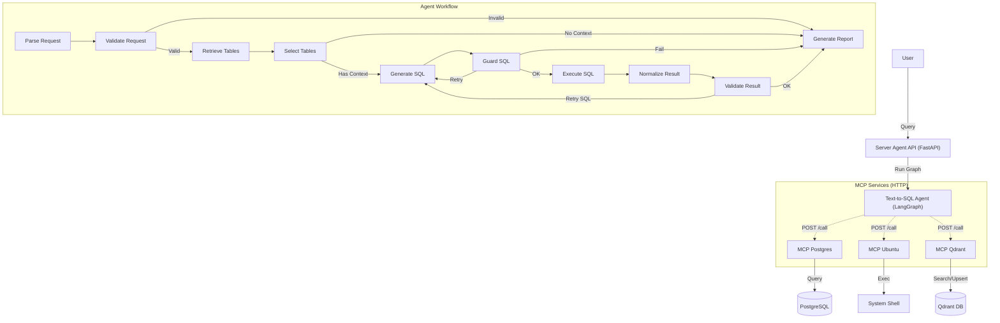

# Server Agent

LangGraph + HTTP MCP + Qdrant 기반의 AI 에이전트 시스템입니다.  
자연어로 데이터베이스(Postgres)를 조회하고, 시스템(Ubuntu) 명령어를 실행할 수 있습니다.

## 🚀 주요 특징

- **LangGraph 기반 에이전트**: 
  - 상태 기반의 추론/검증/재시도 워크플로우
  - **Self-Correction**: SQL 문법 오류 및 실행 에러 자동 수정
  - **Tool Expansion**: 테이블 정보 부족 시 스스로 검색하여 확장 (`needs_more_tables` 감지)
- **HTTP MCP Architecture**: 
  - 각 MCP 서버(Postgres, Ubuntu, Qdrant)가 독립적인 도커 컨테이너 및 HTTP 서비스로 실행
  - `FastAPI` + `uvicorn` 기반의 고성능 통신
- **Qdrant 벡터 검색**:
  - `mcp-qdrant`: 스키마 검색(Search) 및 자동 임베딩 관리(Embeddings) 통합
  - SQL 생성 정확도 향상을 위한 RAG(Retrieval-Augmented Generation) 적용
- **Frontend 실시간 로그**:
  - SSE(Server-Sent Events)를 통해 에이전트의 사고 과정 및 툴 사용 로그 실시간 스트리밍

## 🏗️ 아키텍처



## 📂 프로젝트 구조

```text
server-agent/
├── backend/
│   ├── src/
│   │   ├── agents/          # LangGraph 에이전트 로직
│   │   │   ├── text_to_sql/ # Text-to-SQL 에이전트 (Nodes, Graph, State)
│   │   │   ├── tools/       # 내부 툴 및 Connector
│   │   │   └── middleware/  # 가드레일 (Input/Output Guard)
│   │   ├── api/             # Frontend용 FastAPI 엔드포인트
│   │   └── config/          # 설정 관리 (Env, MCP URL)
│   ├── Dockerfile           # Backend 이미지 빌드
│   └── requirements.txt
├── mcp_servers/             # MCP 서버 (HTTP 어댑터 포함)
│   ├── postgres/            
│   ├── ubuntu/
│   └── qdrant/              # Search & Embeddings 통합 서버
└── docker-compose.yml       # 전체 서비스 오케스트레이션
```

## 🛠️ 설치 및 실행

### 1. 환경 변수 설정
`backend/.env` 파일을 생성하고 필요한 값을 설정합니다.

```ini
# Database
DB_HOST=host.docker.internal
DB_PORT=5432
DB_NAME=your_db
DB_USER=your_user
DB_PASSWORD=your_password

# OpenAI
OPENAI_API_KEY=sk-...

# Qdrant (External)
QDRANT_URL=http://your-qdrant-host:6333
QDRANT_API_KEY=

# MCP Settings (Automatic)
MCP_TRANSPORT=http
```

### 2. 실행 (Docker Compose)
모든 서비스(Backend + 3 MCP Servers)를 한 번에 빌드하고 실행합니다.

```bash
docker-compose up --build
```

### 3. 서비스 포트 정보

| 서비스 | 컨테이너 내부 포트 | 호스트 포트 (테스트용) | 역할 |
|---|---|---|---|
| **Backend** | 8000 | 8000 | 메인 API 서버 |
| **MCP Postgres** | 8000 | 9010 | SQL 실행 |
| **MCP Ubuntu** | 8000 | 9011 | 시스템 명령 실행 |
| **MCP Qdrant** | 8000 | 9012 | 테이블 검색 및 임베딩 |

## ✨ 주요 변경 사항 (2026-02)

1. **MCP 통신 방식 변경**: `stdio` (subprocess) → `HTTP` (FastAPI)
   - 디버깅 용이성 및 컨테이너 격리 강화
2. **Qdrant 서버 통합**: `search`와 `embeddings` 기능을 하나의 `mcp-qdrant` 컨테이너로 통합
3. **Tool Expansion (Node 10 제거 → Tool 통합)**: 
   - `expand_tables` 노드를 제거하고 `generate_sql` 및 `validate_llm` 내부에서 툴(`expand_tables_tool`)을 직접 호출하도록 리팩토링
   - 테이블 부족 시 즉시 확장을 시도하는 능동적 에이전트 구현
4. **프론트엔드 로그 강화**: 툴 사용 내역 및 재시도 사유가 UI에 실시간 표시됨
