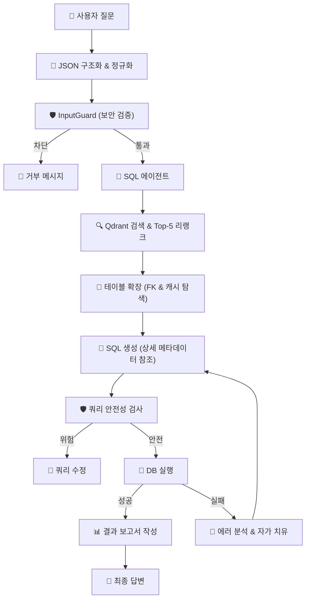

# 🤖 Text-to-SQL Agent (Server Agent)

**서버 모니터링 및 자연어 데이터 분석 에이전트**

이 프로젝트는 자연어 질문을 SQL 쿼리로 변환하여 데이터베이스를 조회하고, 서버 리소스 상태를 실시간으로 모니터링하는 지능형 에이전트 시스템입니다.  
**RAG (Retrieval-Augmented Generation)** 기법과 **LangGraph** 기반의 워크플로우를 사용하여 복잡한 질의를 처리하며, **실시간 스키마 감지** 기능을 통해 DB 구조 변경에 즉시 대응합니다.

---

## 🔥 핵심 기능 (Key Features)

### 1. 🛡️ 보안 미들웨어 (Security Middleware)
사용자의 입력이 시스템에 도달하기 전, **`InputGuard` 미들웨어**가 위험한 요청을 사전에 차단합니다.
- **프롬프트 인젝션 방지**: "Ignore previous instructions", "System prompt" 등 LLM의 동작을 조작하려는 시도를 차단합니다.
- **입력 길이 제한**: 과도한 토큰 사용 유발을 방지합니다 (최대 1000자).
- **SQL 안전성 검사**: 생성된 SQL 쿼리에 `DROP`, `DELETE`, `TRUNCATE` 등 파괴적인 명령어가 포함되었는지 2차 검증합니다.

### 2. ⚡ 실시간 스키마 동기화 (Real-time Schema Sync)
데이터베이스의 테이블이 생성되거나 변경되는 즉시 에이전트가 이를 인지합니다.
- **PostgreSQL LISTEN/NOTIFY**: `SchemaListener`가 DB의 DDL 이벤트를 실시간으로 수신합니다.
- **자동 임베딩 업데이트**: 스키마 변경 시 Qdrant 벡터 저장소의 관련 정보를 자동으로 갱신하여, 에이전트가 항상 최신 테이블 구조를 기반으로 답변할 수 있습니다.

### 3. 🧠 지능형 질의 구조화 및 정규화 (LLM JSON Mode)
사용자의 투박한 질문을 에이전트가 이해하기 쉬운 정교한 구조로 변환합니다.
- **LLM JSON Mode**: 사용자 질문을 즉시 분석하여 파라미터화된 JSON 구조로 변환합니다.
- **시간 범위 정규화**: "오늘 데이터 보여줘"와 같은 질문 시, 현재 시각(예: 오후 3시)을 기준으로 00:00부터 **현재 시각**까지만 조회하도록 범위를 자동으로 교정하여 미래 데이터가 포함되지 않게 합니다.
- **미들웨어 검증**: 구조화된 질문이 유효한지 미들웨어 단계에서 한 번 더 검증하여 SQL 생성의 정확도를 높입니다.

### 4. 🔗 스키마 자동 인식 및 고급 RAG (Table Discovery)
에이전트가 여러 테이블 중 정답을 찾기 위해 벡터 DB와 실시간 스키마 정보를 결합합니다.
- **프로젝트 시작 시 자동 인식**: 서버 구동 시 DB의 전체 스키마를 자동으로 스캔하고 테이블 명세(DDL, 주석)를 추출합니다.
- **벡터화 및 검색**: 추출된 테이블 정보를 Qdrant 벡터 DB에 저장하고, 사용자의 구조화된 질문에서 추출된 질의를 기반으로 가장 적합한 테이블을 RAG(Retrieval) 방식으로 검색해옵니다.
- **동적 컨텍스트 제공**: 검색된 테이블의 **컬럼명, 데이터 타입, 제약 조건(PK/FK), 테이블 주석(Comment)** 등 상세 메타데이터를 SQL 생성 프롬프트에 동적으로 삽입하여 환각(Hallucination) 없는 정확한 쿼리를 유도합니다.
- **지능형 테이블 확장 및 캐싱**: 
    - LLM 리랭크(Rerank)를 거쳐 가장 관련성 높은 **Top-5** 테이블을 우선적으로 컨텍스트에 포함합니다.
    - Top-5에 들지 못한 나머지 후보 테이블들은 내부 캐시에 안전하게 보관합니다.
    - 쿼리 생성이나 검증 단계에서 "테이블 정보가 부족하다"고 판단될 경우, 에이전트가 스스로 **툴 콜(Tool Call)**을 수행하여 캐시된 후보들 중 필요한 테이블을 추가로 탐색하고 컨텍스트를 확장합니다.

### 5. 📂 지속성 채팅 이력 (Persistent Chat History)
사용자와의 모든 대화 결과는 데이터베이스에 안전하게 기록됩니다.
- **세션 기반 관리**: 채팅별 세션 관리를 통해 이전 대화 맥락을 유지하고 나중에 다시 확인할 수 있습니다.
- **자동 제목 생성**: 대화의 첫 문장을 분석하여 채팅 세션의 제목을 자동으로 설정합니다.
- **효율적인 상태 관리**: 메시지 유실 방지를 위한 트랜잭션 기반 저장 구조를 갖추고 있습니다.

### 6. 📊 리소스 모니터링 대시보드
- **실시간 지표**: CPU, 메모리, 디스크 사용량을 실시간으로 시각화합니다.
- **고급 알림 규칙 (Lego Blocks)**: 사용자가 직접 "CPU > 80% 일 때 알림" 같은 규칙을 웹 UI에서 블럭 조립하듯 설정할 수 있습니다.

### 7. 🔌 제로 구성 이식성 (Zero-Config Portability)
이 시스템은 특정 데이터베이스에 종속되지 않는 유연한 구조를 가지고 있습니다.
- **자동 스키마 구축**: `.env`에서 DB 연결 정보만 변경하면, 서버 시작 시 채팅 저장 및 모니터링에 필요한 모든 테이블, 스키마, 그리고 **스키마 변경 및 사용자 규칙기반 모니터링을 위한 이벤트 함수 및 트리거**까지 자동으로 생성합니다.
- **즉시 재사용 가능**: 기존에 사용하던 모든 에이전트 워크플로우와 알림 설정 체계가 새로운 DB 환경에서도 즉시 적용되어, 환경 이관이나 복구가 매우 빠릅니다.

---

## 🛠️ 기술 스택 (Tech Stack)

### Backend
- **Framework**: `FastAPI` (High-performance API)
- **Agent Orchestration**: `LangGraph`, `LangChain`
- **Database**: `PostgreSQL` (Asyncpg for async I/O)
- **Vector Store**: `Qdrant` (Schema embedding & storage)
- **Tooling**: `MCP (Model Context Protocol)` (Standardized tool interface)

### Frontend
- **Framework**: `React`, `Vite` (TypeScript)
- **Styling**: `Vanilla CSS` (Dark Theme Optimized)
- **Components**: `Lucide React` (Icons)

---

## 🚀 에이전트 워크플로우 (Architecture Flow)

사용자가 질문을 입력하면 다음과 같은 과정을 거쳐 답변이 생성됩니다.



---

## 📦 프로젝트 구조 (Directory Structure)

### 📂 `backend/src/` (Core Logic)
백엔드의 핵심 비즈니스 로직이 담긴 디렉토리입니다.

- **`advanced_settings/`**: 사용자가 직접 알림 조건(Lego Blocks)을 설정하는 모듈
    - `schemas.py`: 알림 규칙 및 이력 데이터 검증을 위한 Pydantic 모델
    - `templates.py`: PostgreSQL 트리거 및 함수 생성을 위한 SQL 템플릿
    - `service.py`: 규칙 생성/삭제 및 MCP 서버와의 통신을 담당하는 비즈니스 로직
    - `listener.py`: DB의 `NOTIFY` 신호를 감시하여 실시간 알림을 수신하는 전 전용 리스너
    - `router.py`: 프론트엔드와 통신하는 API 엔드포인트
    - `core.py`: (Deprecated) 이전 버전과의 호환성을 위한 래퍼 모듈
- **`agents/`**: 지능형 에이전트 워크플로우
    - `text_to_sql/`: 자연어를 SQL로 변환하는 LangGraph 노드 및 그래프 정의
    - `middleware/`: 프롬프트 인젝션 및 SQL 안전성을 검사하는 `InputGuard`
- **`api/`**: FastAPI 인프라 설정
    - `main.py`: FastAPI 앱 객체 생성 및 라우터 등록 (진입점)
    - `lifespan.py`: 서버 시작 시 DB 초기화 및 리스너 가동, 종료 시 자원 해제 관리
    - `query.py`: 에이전트 실행 및 결과 스트리밍 엔드포인트
- **`db/`**: 데이터베이스 관리
    - `db_manager.py`: `asyncpg` 커넥션 풀 초기화 및 채팅 세션/메시지 CRUD 로직
- **`schema/`**: 실시간 DB 스키마 동기화
    - `orchestrator.py`: 초기 동기화 및 리스너 실행 제어
    - `listener.py`: DB의 DDL 변경 이벤트(`CREATE/ALTER TABLE`) 감지
    - `sync.py`: 변경된 스키마를 Qdrant 벡터 저장소에 반영(Embedding)

### 📂 `mcp_servers/` (Tool Connectors)
에이전트가 사용하는 도구(Tools)를 표준화된 방식으로 제공합니다.

- **`postgres/`**: SQL 쿼리 실행, 테이블 목록 조회, 스키마 명세 추출 툴 제공
- **`qdrant/`**: 테이블 정보 검색(Vector Search) 및 임베딩 툴 제공

### 📂 `frontend/` (Dashboard)
- `React + Vite` 기반의 싱글 페이지 애플리케이션(SPA)
- 실시간 리소스 모니터링 및 알림 이력 대시보드 제공

---

## 🚀 시작하기 (Getting Started)

### 1. 환경 변수 설정
`.env` 파일을 생성하고 필요한 API 키와 DB 설정을 입력하세요.

### 2. 실행
Docker Compose를 사용하여 모든 서비스를 한 번에 실행합니다.

```bash
docker compose up --build -d
```

### 3. 접속
- **웹 UI**: [http://localhost:5173](http://localhost:5173) (또는 80번 포트 설정에 따름)
- **API 문서**: [http://localhost:8000/docs](http://localhost:8000/docs)
